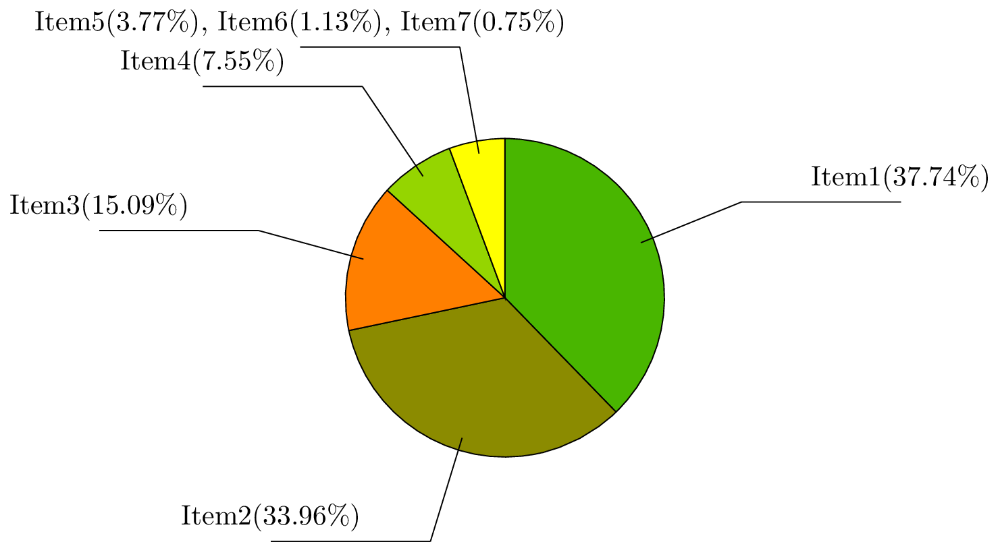

This is used to generate a pie chart for given data with python.

Here is a sample chart generated.

As you see, pie_generator will automatically merge the items which is too small in the pie chart.

pie_generator uses tikz, so it depends on *pdflatex* and *convert*.